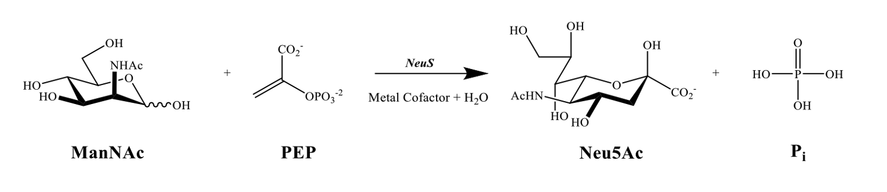

# From HPLC chromatograms to enzyme kinetics, with an AI assistant

In this workshop you turn raw HPLC data of a real enzyme into kinetic parameters
(`kcat`, `Km`). An AI chat assistant writes the code; **you make the scientific decisions and
check the results.** No programming experience is needed.

You will:

1. read raw chromatograms, find the product peak and calibrate it
   (tool: [Chromhandler](https://github.com/FAIRChemistry/Chromhandler)),
2. save the concentration time courses as an [EnzymeML](https://enzymeml.org) document,
3. infer the parameters of a kinetic model from them, as posterior distributions
   (tool: [Catalax](https://github.com/FAIRChemistry/Catalax)).

## The experiment

Neu5Ac synthase (NeuS) condenses two substrates into sialic acid:



Product formation was followed by HPLC. In one series ManNAc was varied (13 reactions), in the
other PEP (11 reactions); each reaction was sampled six times. Five calibration standards contain
known amounts of Neu5Ac. Details, including where Neu5Ac elutes: [data/README.md](data/README.md).

## Start here

### Option A: Google Colab (nothing to install)

You need a Google account.

1. Open the notebook for task 1 in Colab:
   <https://colab.research.google.com/github/haeussma/neus-workshop/blob/main/notebooks/01_hplc_to_enzymeml.ipynb>
2. Run the first cell. It installs the tools and downloads this repository (about 2 min).
3. Open your AI assistant: Gemini inside Colab (the ✨ icon), or ChatGPT / Claude / any other
   chat in a second browser tab.

### Option B: on your own computer

For people who already use Python or an AI coding agent (Claude Code, Codex, Cursor, ...).
Install [uv](https://docs.astral.sh/uv/getting-started/installation/), then:

```bash
git clone https://github.com/haeussma/neus-workshop
```

```bash
cd neus-workshop && uv sync
```

Coding agents can use the tool cards directly: copy `briefs/chromhandler.md` and
`briefs/catalax.md` into your agent's instructions (`AGENTS.md`, `CLAUDE.md` or a `SKILL.md`).

## The tasks

Each task has a **tool card** (tells the assistant how to use the tool) and a **task card**
(tells it what you want). Paste both into the chat.

| Task | Result | Tool card | Task card | Reference solution |
| --- | --- | --- | --- | --- |
| 1. Chromatograms → EnzymeML | calibrated Neu5Ac time courses of 24 reactions | [briefs/chromhandler.md](briefs/chromhandler.md) | [briefs/task_1_chromatograms_to_enzymeml.md](briefs/task_1_chromatograms_to_enzymeml.md) | [notebooks/01_hplc_to_enzymeml.ipynb](notebooks/01_hplc_to_enzymeml.ipynb) |
| 2. Kinetic model | posterior distributions of `kcat`, `Km_ManNAc`, `Km_PEP`, with corner and fit plots | [briefs/catalax.md](briefs/catalax.md) | [briefs/task_2_kinetic_model.md](briefs/task_2_kinetic_model.md) | [notebooks/02_kinetic_model.ipynb](notebooks/02_kinetic_model.ipynb) |

Stuck in task 1? Start task 2 from [checkpoints/neus_enzymeml.json](checkpoints/neus_enzymeml.json).

## How to work with the assistant

1. Paste the tool card, then the task card, then write: *Let's start with task 1.*
2. Run the code it gives you. If there is an error, paste the error back.
3. Look at every plot before you continue. The assistant will ask you for decisions,
   e.g. where the peak is. Those are yours to make.
4. The task card lists checks with expected values. You are done when all of them pass.

## Try things out

The reference notebooks are open: run them, change a retention window, drop a series from the
fit, change the model. Ask the assistant to explain any line. Breaking things here costs nothing.

## What is in this repository

```
README.md        you are here
briefs/          tool cards and task cards to paste into the chat
data/            raw HPLC exports, initial concentrations, data description
notebooks/       reference solutions for both tasks
checkpoints/     result of task 1, to start task 2 directly
slides/          workshop slides and figures
```

## Tools and versions

| Package | Version | Role |
| --- | --- | --- |
| chromhandler | 0.10.11 | read HPLC data, assign peaks, calibrate, export EnzymeML |
| catalax | 0.5.5 | kinetic models, Bayesian parameter inference (HMC) |
| Python | 3.12 (3.11–3.13 work) | |

Two things to know about Catalax 0.5.5, both handled in the tool card and the reference notebook:
call `catalax.enable_x64()` before anything else, and leave every model state observable with
NaN arrays for the unmeasured ones (`observable=False` silently breaks the sampler in this
version: it compares every state with the data).

## Reference results

Posterior mean ± sd (3–97 % interval); 2 chains × (500 warmup + 1000 samples), Gaussian
likelihood, log-uniform priors.

| Result | Value |
| --- | --- |
| Neu5Ac calibration | 239 349 area per mM, R² = 0.999 |
| `kcat` | 364 ± 6 min⁻¹ (353–374; 6.1 s⁻¹, 9.4 U/mg) |
| `Km_ManNAc` | 1.53 ± 0.19 mM (1.16–1.89) |
| `Km_PEP` | 0.59 ± 0.07 mM (0.45–0.72) |
| estimated noise `sigma` | 0.09 mM |

One shared `kcat` over-predicts the ManNAc series and under-predicts the PEP series: the two
series, measured on different days, differ in enzyme activity by roughly 25 %. A good question
for the discussion.
